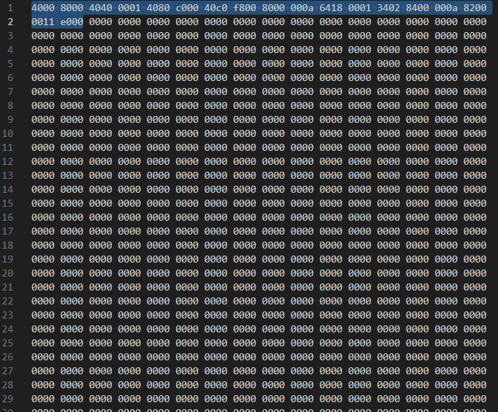

# Organ 16 assembly v1.0.0 - Documentation

## Synthax :

### Instructions :

66C1 = LOADR R3, R1

6419 = STORER R3, R1


Here are the 33 currently usable instructions :

| Instruction | `OpCode` | `SubOpCode` | Word count | Example          | Description                       |
|-------------|----------|-------------|------------|------------------|-----------------------------------|
| ADD         | `000`    | `0000`      | (1 word)   | ADD R1, R2, R3   | Add R2 and R3, store in R1        |
| SUB         | `000`    | `0001`      | (1 word)   | SUB R1, R2, R3   | Subtract R3 from R2, store in R1  |
| MUL         | `000`    | `0010`      | (1 word)   | MUL R1, R2, R3   | Multiply R2 and R3, store in R1   |
| DIV         | `000`    | `0011`      | (1 word)   | DIV R1, R2, R3   | Divide R2 by R3, store in R1      |
| MOD         | `000`    | `0100`      | (1 word)   | MOD R1, R2, R3   | Modulo R2 % R3, store in R1       |
| AND         | `000`    | `0101`      | (1 word)   | AND R1, R2, R3   | Bitwise AND, store in R1          |
| OR          | `000`    | `0110`      | (1 word)   | OR R1, R2, R3    | Bitwise OR, store in R1           |
| NAND        | `000`    | `0111`      | (1 word)   | NAND R1, R2, R3  | Bitwise NAND, store in R1         |
| NOR         | `000`    | `1000`      | (1 word)   | NOR R1, R2, R3   | Bitwise NOR, store in R1          |
| XOR         | `000`    | `1001`      | (1 word)   | XOR R1, R2, R3   | Bitwise XOR, store in R1          |
| NOT         | `001`    | `1011`      | (1 word)   | NOT R1, R2       | Bitwise NOT of R2 into R1         |
| MOV         | `010`    | `0000`      | (2 words)  | MOV R1, 0x1234   | Move 16-bit immediate into R1     |
| LOAD        | `011`    | `0000`      | (2 words)  | LOAD R1, 0x1000  | Load from memory to R1            |
| LOADR       | `011`    | `0011`      | (1 word)   | LOADR R3, R1     | Load from memory[R1] to R3        |
| STORE       | `011`    | `0001`      | (2 words)  | STORE R1, 0x1000 | Store R1 at memory[Immediate]     |
| STORER      | `011`    | `0010`      | (1 word)   | STORER, R3, R1   | Store R3 at memory[R1]            |
| JMP         | `100`    | `0000`      | (2 words)  | JMP 0x1000       | Unconditional jump                |
| JE          | `100`    | `0001`      | (2 words)  | JE 0x1000        | Jump if equal                     |
| JNE         | `100`    | `0010`      | (2 words)  | JNE 0x1000       | Jump if not equal                 |
| JB          | `100`    | `0011`      | (2 words)  | JB 0x1000        | Jump if below (unsigned)          |
| JBE         | `100`    | `0100`      | (2 words)  | JBE 0x1000       | Jump if below or equal (unsigned) |
| JA          | `100`    | `0101`      | (2 words)  | JA 0x1000        | Jump if above (unsigned)          |
| JAE         | `100`    | `0110`      | (2 words)  | JAE 0x1000       | Jump if above or equal (unsigned) |
| JL          | `100`    | `0111`      | (2 words)  | JL 0x1000        | Jump if less (signed)             |
| JLE         | `100`    | `1000`      | (2 words)  | JLE 0x1000       | Jump if less or equal (signed)    |
| JG          | `100`    | `1001`      | (2 words)  | JG 0x1000        | Jump if greate(signed)          |
| JGE         | `100`    | `1010`      | (2 words)  | JGE 0x1000       | Jump if greater or equal (signed) |
| JSR         | `100`    | `1011`      | (2 words)  | JSR 0x1000       | Push PC, jump to subroutine       |
| RTS         | `100`    | `1100`      | (2 words)  | RTS              | Pop return address, jump to it    |
| HLT         | `111`    | `0000`      | (1 word)   | HLT              | Halt the CPU                      |
| CMP         | `001`    | `1010`      | (1 word)   | CMP R1, R2       | Compare R1 and R2                 |
| PUSH        | `101`    | `0000`      | (1 word)   | PUSH R1          | Push R1 onto the stack            |
| POP         | `101`    | `0001`      | (1 word)   | POP R1           | Pop top of stack into R1          |


### Immediates : 

Immediates are hard-coded literal values used directly in instructions—for operations, jumps, or memory manipulation.
They are not loaded from memory but embedded directly into the instruction at compile time.

As of Organ 16 Assembly v1.0.0, immediates can be written in the following formats:

Binary: Prefix with 0b (e.g., 0b10101)

Decimal: Plain number with no prefix (e.g., 12)

Hexadecimal: Prefix with 0x (e.g., 0xABCD)

Immediates can also be operations to be evaluated at compile time : MOV R0, 2 * 2

### Constants :

Constants are defined using the @define directive and serve as named values that can be reused throughout the source code.
Once defined, a constant will be replaced with its corresponding value during compilation, allowing for cleaner, more maintainable code.

Example :
```asm
@define SCREEN_WIDTH  128

LOAD R1, SCREEN_WIDTH
```

### Labels :

Labels act similarly to functions or named locations within a program. In .org source files, they are defined using a human-readable name. However, in the compiled .bin file, they are represented by their corresponding memory addresses.

A program can use JMP or conditional jump instructions to jump to any label at any point during execution. Labels are essential for implementing control flow structures such as loops, branches, and subroutines.

Example :
```asm
start:
    LOAD R1, 0x10
    JMP end

end:
    HLT
```

### Comments :

Comments can appear anywhere in a line—either on a line by themselves or at the end of a line of code.
A comment begins with either the # or ; symbol and continues to the end of the line. Comments are ignored during compilation and have no effect on the resulting binary.

Examples:
```asm
LOAD R1, 0x10   &emsp;  ;Load value into register R1

#This is a full-line comment
```

## Compiling :

### Source files

Source files (.org) follow the org16 format and contain the raw assembly instructions to be compiled.
Source files should be in the same directory as the linker script

### Linker file

The linker file (.l) (format = json) is responsible for combining multiple source files into a single executable program (.bin).
When the compiler opens the linker file, it searches for a segments list that specifies every source file to be combined along with their respective memory start addresses. This allows the compiler to properly map each module in memory.
If a file is mapped inside the stack space (0xF000 - 0xFFFF) it will be truncated or even fully removed as this memory region must remain blank to preserve runtime stack operations.
As of Organ 16 Assembly v1.0.0, users can freely map data into the framebuffer region (0x8000 – 0xBFFF) during compilation.
Note: This data will not be automatically displayed on-screen; screen output only occurs during runtime via the STORE or STORER instructions.

### Python compiler

This is how you usually compile a file : (first argument is : compiler path, second arguemnt is : linker script path)

```powershell
python.exe Path/to/Compiler/compiler.py Path/to/Linker/Script/linker.l
```

This will output a .bin file that you can directly import into the emulator/logisim evolution's RAM component.

Example: 


